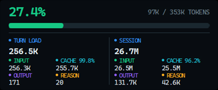

# Codex Context Meter Lite

[English](README.md) | [简体中文](README.zh-CN.md)

A lightweight, read-only Windows overlay for Codex context usage, with no Codex modification required.

Codex Context Meter Lite reads the local session JSONL files already produced by Codex and shows current context pressure and token details at the edge of the Codex window. It is a single-file portable app and requires no Codex++, plugin, Node.js, Python, or background service.

## Interface Preview

| Collapsed | Expanded |
| --- | --- |
|  |  |

## Key Features

- **Live context usage:** Checks the active session every 500 ms and calculates Used/Left as `last_token_usage.total_tokens / model_context_window`.
- **Continuous pressure bar:** Green through 75% used, amber above 75% through 85%, and red above 85%.
- **Compact and detailed views:** Shows a 28 px compact strip by default; hover to expand Turn and Session totals for Total, Input, Cache, cache hit rate, Output, and Reasoning tokens.
- **Codex window tracking:** The non-activating overlay identifies Codex using package identity and controlled path rules, follows the active Codex window when multiple windows are open, and tracks movement, resizing, minimization, DPI, and monitor changes.
- **Four-corner anchoring:** Drag it to any Codex window corner. Top anchors expand downward and bottom anchors expand upward.
- **Automatic or pinned task:** Selects the latest session containing a valid `token_count` event by default, or lets you pin a task from the tray menu. Task names come from `session_index.jsonl`.
- **Resilient incremental reading:** Handles partial JSONL writes, malformed lines, truncation, rotation, and context compaction without reading conversation text.
- **Tray controls:** Controls visibility, Used/Left mode, dark/light theme, 80%/100%/120% scale, session selection, and optional per-user startup.
- **Single-instance portable operation:** Runs one production instance per user session with no installer, service, or scheduled task.

## Requirements

- Windows 10 or Windows 11, 64-bit.
- Codex Desktop for Windows must be installed and launched at least once. The app prefers the `OpenAI.Codex` package identity for official MSIX builds and also supports controlled enterprise paths and an explicit EXE override.
- Codex session data defaults to `%USERPROFILE%\.codex`; when `CODEX_HOME` is set, that directory is preferred, while command-line overrides have the highest priority.

## Usage

1. Extract `codex-context-meter-lite.exe` from the release ZIP into any writable directory. No installation is required.
2. Double-click the EXE. The app stays in the Windows notification area and automatically reads the latest valid Codex session.
3. Switch to the Codex main window. The compact overlay appears at its edge and hides automatically when Codex is minimized or no longer in the foreground.
4. Hover over the overlay for details; hold the left mouse button and drag to change its anchor and offset.
5. Right-click the overlay or tray icon to open settings. Double-click the tray icon to quickly show or hide the overlay.
6. Choose `Quit` from the tray menu to exit. Closing Codex does not exit this app.

## Tray Menu

| Menu item | Description |
| --- | --- |
| `Codex window: detected / not detected` | Read-only Codex window detection status |
| `Session data: detected / not detected` | Read-only valid token-session status |
| `Show overlay` | Show or hide the overlay |
| `Show context used` | Show Used when checked; show Left when unchecked |
| `Light theme` | Switch between light and dark themes |
| `Scale 80% / 100% / 120%` | Change the overlay scale |
| `Session: Auto (latest active)` | Follow the latest valid session automatically |
| Session list | Pin the selected task; choose Auto to unpin |
| `Start with Windows` | Add or remove the current user's startup entry |
| `Quit` | Exit the app and remove the tray icon |

## Data and Privacy Boundary

By default, the app only reads these Codex files:

```text
%USERPROFILE%\.codex\sessions\**\*.jsonl
%USERPROFILE%\.codex\session_index.jsonl
```

When `CODEX_HOME` or command-line path overrides are used, the app reads the corresponding `sessions` and `session_index.jsonl` under the selected location; the access boundary remains unchanged.

The app does not modify the `.codex` directory, Codex installation, or `app.asar`. It does not use CDP, DOM injection, React Fiber, network APIs, authentication files, secrets, or provider tokens. It parses only structured `session_meta` and `token_count` records, not message content.

The app creates its own configuration only after the user changes a setting:

```text
%LOCALAPPDATA%\CodexContextMeterLite\config.json
```

When `Start with Windows` is enabled, the app writes only `HKCU\Software\Microsoft\Windows\CurrentVersion\Run\CodexContextMeterLite`; disabling the option removes that entry.

## Metric Reference

| Metric | Description |
| --- | --- |
| `Used` | Current context usage percentage and tokens |
| `Left` | Remaining context percentage and tokens |
| `Turn` | Latest `last_token_usage` record |
| `Session` | Cumulative `total_token_usage` for the session |
| `Input` | Input tokens |
| `Cache` | Cached input tokens |
| `Cache hit` | Cached input tokens divided by input tokens for the turn or session |
| `Output` | Output tokens |
| `Reasoning` | Reasoning output tokens |

`Session` is cumulative consumption, not model context-window occupancy; context pressure always uses the latest `last_token_usage.total_tokens`.

Cache hit rate is calculated independently for Turn and Session. The Session value uses cumulative cached input tokens divided by cumulative input tokens; it is not an average of per-turn percentages.

## Troubleshooting

If the tray icon is present but no overlay appears on Codex, first open the tray menu and check the `Codex window` and `Session data` status lines.

```powershell
# Verify that the standalone UI can be displayed without Codex window detection
.\codex-context-meter-lite.exe --demo

# Inspect the Codex process and package identity without reading conversation data
Get-Process -Name ChatGPT,Codex -ErrorAction SilentlyContinue |
  Select-Object Id, ProcessName, Path, MainWindowTitle, MainWindowHandle

Get-AppxPackage |
  Where-Object Name -Match '^OpenAI\.(Codex|ChatGPT)$' |
  Select-Object Name, PackageFamilyName, Version, Architecture, InstallLocation
```

If `--demo` works but the menu says `Codex window: not detected`, the installation channel or process identity is usually unmatched. If the window is detected but session data is not, check `CODEX_HOME` or the session paths. These commands do not read JSONL contents, conversation text, tokens, or authentication data.

## CLI and Development

```powershell
# Show the version
.\codex-context-meter-lite.exe --version

# Use custom Codex data paths
.\codex-context-meter-lite.exe --sessions "D:\path\to\sessions" `
  --session-index "D:\path\to\session_index.jsonl"

# Bind an enterprise/repackaged Codex executable explicitly
.\codex-context-meter-lite.exe --codex-exe "D:\Apps\Codex\ChatGPT.exe"

# Open a standalone UI with synthetic data
.\codex-context-meter-lite.exe --demo
```

Building requires Go 1.26 or later.

```powershell
go test ./...
go test -race ./...
go vet ./...
.\scripts\build.ps1
```

The release script creates a portable single-EXE ZIP and installs no dependencies. The current build target is `dist\codex-context-meter-lite-windows-amd64-v0.1.1.zip`.

## Uninstall

1. Choose `Quit` from the tray menu.
2. If `Start with Windows` is enabled, disable it from the tray menu first.
3. Delete the extracted app directory. To remove preferences as well, manually delete `%LOCALAPPDATA%\CodexContextMeterLite`.

## References

This project referenced the following open-source projects during its design and implementation evaluation:

- [Codex Context Used Meter](https://github.com/Minghou-Lei/codex-context-used-meter)
- [Codex Monitor](https://github.com/KevinKE93/Codex-Monitor)

## License

This project is licensed under the MIT License. See [THIRD_PARTY_NOTICES.md](THIRD_PARTY_NOTICES.md) for third-party projects and Go dependency notices.
